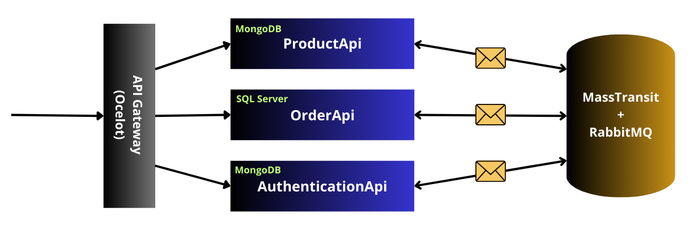

# eCommerce Microservices Project

This project is designed to help you practice building microservices using .NET. The application consists of three main services:

- **OrderApi**
- **ProductApi**
- **AuthenticationApi**

The services communicate with each other through a messaging system implemented with **MassTransit** and **RabbitMQ**. An **API Gateway** using **Ocelot** is used to access these services, with caching enabled to improve performance.

## Architecture

- **OrderApi**
  - **Purpose**: Manages orders in the eCommerce application.
  - **Database**: SQL Server.
  - **Authentication**: Requires JWT (JSON Web Token) for authorization. Tokens must be included in the `Authorization` header as type `Bearer`.
  - **Features**:
    - Uses **Entity Framework Core** for data access.
    - Subscribes to RabbitMQ messages to register new users or products from AuthenticationApi and ProductApi respectively.

- **AuthenticationApi**
  - **Purpose**: Manages user authentication and registration.
  - **Database**: MongoDB.
  - **Features**:
    - Uses **MongoDB.Driver** for database operations.
    - Generates JWT tokens for user authentication.
    - Publishes messages to RabbitMQ to inform other services about new users.

- **ProductApi**
  - **Purpose**: Manages product information in the eCommerce application.
  - **Database**: MongoDB.
  - **Features**:
    - Uses **MongoDB.Driver** for database operations.
    - Publishes messages to RabbitMQ to notify other services when products are created or updated.

## API Gateway

The API Gateway is implemented with **Ocelot** to route requests to the appropriate microservices. It includes caching to improve performance and rate limiting to manage traffic.

### Example Route Configuration

```json
{
  "Routes": [
    {
      "DownstreamPathTemplate": "/api/Order/{everything}",
      "DownstreamScheme": "https",
      "DownstreamHostAndPorts": [
        {
          "Host": "localhost",
          "Port": 5010
        }
      ],
      "UpstreamPathTemplate": "/api/Order/{everything}",
      "UpstreamHttpMethod": [ "GET", "POST" ],
      "AuthenticationOptions": {
        "AuthenticationProviderKey": "Bearer",
        "AllowedScopes": []
      },
      "FileCacheOptions": {
        "TtlSeconds": 60,
        "Region": "Orders"
      }
    },
    {
      "DownstreamPathTemplate": "/api/Product/{Everything}",
      "DownstreamScheme": "https",
      "DownstreamHostAndPorts": [
        {
          "Host": "localhost",
          "Port": 5001
        }
      ],
      "UpstreamPathTemplate": "/api/Product/{everything}",
      "UpstreamHttpMethod": [ "GET", "POST" ],
      "AuthenticationOptions": {
        "AuthenticationProviderKey": "Bearer",
        "AllowedScopes": []
      },
      "FileCacheOptions": {
        "TtlSeconds": 120,
        "Region": "Products"
      }
    },
    {
      "DownstreamPathTemplate": "/api/User/{everything}",
      "DownstreamScheme": "https",
      "DownstreamHostAndPorts": [
        {
          "Host": "localhost",
          "Port": 5100
        }
      ],
      "UpstreamPathTemplate": "/api/User/{everything}",
      "UpstreamHttpMethod": [ "GET", "POST" ],
      "RateLimitOptions": {
        "EnableRateLimiting": true,
        "Period": "1m",
        "Limit": 100
      }
    }
  ],
  "GlobalConfiguration": {
    "BaseUrl": "https://localhost:5002",
    "RateLimitOptions": {
      "EnableRateLimiting": true,
      "QuotaExceededMessage": "You have reached the limit of requests allowed"
    },
    "FileCacheOptions": {
      "TtlSeconds": 300
    }
  }
}
```

## Technologies Used

- **.NET 8** for building microservices.
- **Ocelot** for API Gateway implementation.
- **MassTransit** and **RabbitMQ** for messaging between services.
- **MongoDB** for AuthenticationApi and ProductApi databases.
- **SQL Server** for OrderApi database.
- **JWT** for secure authentication and authorization.
- **EF Core** for ORM in OrderApi.

## Diagram



## How to Run the Project

1. **Set Up RabbitMQ**
   - Install RabbitMQ and ensure it is running locally.

2. **Configure Databases**
   - Set up MongoDB for AuthenticationApi and ProductApi.
   - Set up SQL Server for OrderApi.

3. **Start the Services**
   - Run each microservice individually.

4. **Run the API Gateway**
   - Configure and start the Ocelot Gateway.

5. **Test the Endpoints**
   - Use tools like Postman to test the API Gateway and individual microservices.
